# SC7F0 N1 HDMI2 V11: HDMI RX / TX 與 PCIe DMA Engine 整合架構計畫書

本文件詳細規劃 **SC7F0 N1 HDMI2 V11 (AMD/Xilinx Zynq UltraScale+ XCZU4EV-2FBVB900E)** 板卡上，如何將 **HDMI RX（輸入擷取）** 與 **HDMI TX（輸出播放）** 完整整合至現有 **多通道 PCIe DMA 串流引擎（Multi-Channel PCIe DMA Engine）**，並同時保有內部硬體迴路（Loopback）與測試圖案（TPG）。

---

## 1. 系統架構總覽 (System Architecture Overview)

為滿足專業廣播級與工業影音擷取／播放卡的需求，系統採用 **4 組獨立全對稱通道架構（4-Channel Dedicated Streams Architecture）**：

| 通道編號 | 視訊路徑 (Video Datapath) | 音訊路徑 (Audio Datapath) | 傳輸方向 | 應用場景 |
|:---:|---|---|:---:|---|
| **Ch 0** | **HDMI RX 即時視訊擷取** | **HDMI RX 即時 L-PCM 音訊** | **C2H** (Device $\to$ Host) | 實體 HDMI 輸入擷取 (`/dev/video0`, `hw:0,0`) |
| **Ch 1** | **HDMI TX 即時視訊輸出** | **HDMI TX 即時 L-PCM 播音** | **H2C** (Host $\to$ Device) | 實體 HDMI 輸出播放 (`/dev/video1`, `hw:0,1`) |
| **Ch 2** | **硬體迴路測試 (Loopback)** | **音訊硬體迴路 (Loopback)** | **H2C $\to$ C2H** | 純硬體內部環回，用於 PCIe 吞吐量自檢 |
| **Ch 3** | **內部 TPG 彩條產生器** | **內部 AES3/Sine 音訊產生器** | **C2H** (Device $\to$ Host) | 無外接訊號線時的系統診斷訊號源 |

```mermaid
flowchart TD
    subgraph Host_Memory["主機端記憶體 (Host PCIe V4L2 / ALSA Drivers)"]
        H_RX_V["V4L2 Capture: HDMI RX (/dev/video0)"]
        H_TX_V["V4L2 Output: HDMI TX (/dev/video_out1)"]
        H_LB_V["V4L2 Loopback: (/dev/video_lb2)"]
        H_TPG_V["V4L2 TPG: (/dev/video_tpg3)"]

        H_RX_A["ALSA Capture: HDMI RX (hw:0,0)"]
        H_TX_A["ALSA Playback: HDMI TX (hw:0,1)"]
        H_LB_A["ALSA Loopback: (hw:0,2)"]
        H_TPG_A["ALSA TPG: (hw:0,3)"]
    end

    subgraph PCIe_DMA["custom_pcie_dma_top (PCIe Gen3 x4 256-bit)"]
        direction TB
        subgraph Video_Engines["Video DMA Engines (128-bit AXI-Stream)"]
            V_C2H_0["Video C2H Ch0"]
            V_H2C_1["Video H2C Ch1"]
            V_C2H_2["Video C2H Ch2"]
            V_H2C_2["Video H2C Ch2"]
            V_C2H_3["Video C2H Ch3"]
        end
        subgraph Audio_Engines["Audio DMA Engines (32-bit AXI-Stream)"]
            A_C2H_0["Audio C2H Ch0"]
            A_H2C_1["Audio H2C Ch1"]
            A_C2H_2["Audio C2H Ch2"]
            A_H2C_2["Audio H2C Ch2"]
            A_C2H_3["Audio C2H Ch3"]
        end
    end

    subgraph Datapath_Bridges["串流格式轉換與時脈域轉換 (CDC Bridges)"]
        RX_V_BRIDGE["HDMI RX Video Bridge & CDC<br/>(4 PPC Native $\to$ 128-bit Packed)"]
        RX_A_BRIDGE["HDMI RX Audio Packet Bridge<br/>(Audio Sample $\to$ 32-bit AXI-S)"]
        TX_V_BRIDGE["HDMI TX Video Bridge & CDC<br/>(128-bit Packed $\to$ 4 PPC Native)"]
        TX_A_BRIDGE["HDMI TX Audio Packet Inserter<br/>(32-bit AXI-S $\to$ HDMI Audio)"]
        LB_FIFO["Video/Audio Hardware Loopback FIFO"]
    end

    subgraph Peripherals["實體硬體與 IP 模組"]
        HDMI_RX_IP["v_hdmi_rx_ss (Quad 226 RX)"]
        HDMI_TX_IP["v_hdmi_tx_ss (Quad 226 TX)"]
        TPG_MOD["v_tpg_0 + Overlay Marker"]
        AUD_MOD["audio_pattern_gen"]
    end

    %% C2H Ch0: HDMI RX
    HDMI_RX_IP -->|AXI4-Stream Video| RX_V_BRIDGE --> V_C2H_0 --> H_RX_V
    HDMI_RX_IP -->|AXI4-Stream Audio| RX_A_BRIDGE --> A_C2H_0 --> H_RX_A

    %% H2C Ch1: HDMI TX
    H_TX_V --> V_H2C_1 --> TX_V_BRIDGE -->|AXI4-Stream Video| HDMI_TX_IP
    H_TX_A --> A_H2C_1 --> TX_A_BRIDGE -->|AXI4-Stream Audio| HDMI_TX_IP

    %% Ch2: Loopback
    H_LB_V --> V_H2C_2 --> LB_FIFO --> V_C2H_2 --> H_LB_V
    H_LB_A --> A_H2C_2 --> LB_FIFO --> A_C2H_2 --> H_LB_A

    %% Ch3: TPG & Audio Gen
    TPG_MOD --> V_C2H_3 --> H_TPG_V
    AUD_MOD --> A_C2H_3 --> H_TPG_A
```



---

## 2. 實體硬體與 GTH 收發器分配 (Hardware Allocation)

在 SC7F0 N1 HDMI2 V11 上，實體晶片與 GTH Quad 分配如下：

```
+-----------------------------------------------------------------------------------+
|                              AMD ZU4EV (FBVB900)                                  |
|                                                                                   |
|  [Bank 223 - Quad 223]  <=======> PCIe Gen3 x4 (Golden Finger -> Host PC)         |
|                                                                                   |
|  [Bank 226 - Quad 226]  <-------  HDMI RX 3x TMDS Lanes (From U9 IT6663FN)        |
|                         =======>  HDMI TX 4x TMDS Lanes (To U13 IT66318 Retimer)  |
|                                                                                   |
|  [Bank 225 - Quad 225]  <-------  DRU RefClk (From U8 Si5341 Clock Generator)     |
|                                                                                   |
|  [Bank 46 - HDIO 3.3V]  <=======> DDC I2C, HPD, Cable Detect (RX & TX)            |
+-----------------------------------------------------------------------------------+
```

### 實體腳位速查表
1. **PCIe 介面 (Quad 223)**：
   - 專用於主機端 PCIe 傳輸，佔用專用 MGT 腳位。
2. **HDMI RX 介面 (Quad 226 RX + Bank 46)**：
   - `TMDS Clock`: `B10 / B9` (Bank 226, `MGTREFCLK1`)
   - `TMDS Data 0`: `D2 / D1` (Bank 226, `GTHE4_CHANNEL_X0Y12`)
   - `TMDS Data 1`: `C4 / C3` (Bank 226, `GTHE4_CHANNEL_X0Y13`)
   - `TMDS Data 2`: `B2 / B1` (Bank 226, `GTHE4_CHANNEL_X0Y14`)
   - `DRU Clock`: `H10 / H9` (Bank 225, `MGTREFCLK0`)
   - `DDC SCL/SDA`: `E13 / D14` (Bank 46, 3.3V)
   - `HPD Out`: `A13` (Bank 46, 3.3V)
   - `Cable 5V Det`: `B12` (Bank 46, 3.3V)
3. **HDMI TX 介面 (Quad 226 TX + Bank 46)**：
   - `TMDS Clock`: `A8 / A7` (Bank 226, `MGTHTX3_226`)
   - `TMDS Data 0`: `H2 / H1` (Bank 225/226, `MGTHTX0`)
   - `TMDS Data 1`: `C8 / C7` (Bank 226, `MGTHTX1_226`)
   - `TMDS Data 2`: `B6 / B5` (Bank 226, `MGTHTX2_226`)
   - `TX HPD In`: 透過 Bank 46 輸入檢測螢幕連接。
   - `TX DDC SCL/SDA`: 透過 Bank 46 讀取螢幕 EDID。

---

## 3. 視訊與音訊資料路徑橋接整合 (Datapath Integration)

### 3.1 HDMI RX $\to$ PCIe DMA C2H (Channel 0)

1. **視訊路徑 (Video C2H)**：
   - **來源規格**：`v_hdmi_rx_ss` 輸出原生 AXI4-Stream Video。在 4K60 模式下，每個時脈週期傳輸 4 PPC（Pixels Per Clock），色彩格式可為 RGB24、YCbCr 4:4:4 或 4:2:2。
   - **橋接模組 (`hdmi_rx_video_bridge.v`)**：
     - **非同步 FIFO (CDC)**：將視訊時脈域（`rx_video_clk`，約 148.5MHz～297MHz）平滑轉換至 PCIe DMA 時脈域（`pcie_user_clk` = 250MHz）。
     - **像素重排與打包 (Pixel Packing)**：將 4 個像素重排為 128-bit AXI-Stream（低字節對齊小端序 Little-Endian，與 Host V4L2 RGB24 / NV12 / UYVY 直接相容）：
       ```
       128-bit TDATA = { 8'hFF, P3[B,G,R], 8'hFF, P2[B,G,R], 8'hFF, P1[B,G,R], 8'hFF, P0[B,G,R] }
       ```
     - **同步訊號轉換**：將 `v_hdmi_rx_ss` 的幀起始（SOF）轉換為 `video_ch0_tuser[0]`，行結束轉換為 `video_ch0_tlast`。
   - **接點**：輸出直連 `custom_pcie_dma_top` 的 `video_ch0_tdata`、`tvalid`、`tlast`、`tuser`。

2. **音訊路徑 (Audio C2H)**：
   - **來源規格**：`v_hdmi_rx_ss` 提取出 HDMI 音訊取樣封包（L-PCM 16/24-bit，48kHz / 96kHz / 192kHz）。
   - **橋接模組 (`hdmi_rx_audio_bridge.v`)**：
     - 將音訊封包轉為 32-bit AXI4-Stream 取樣（標準雙聲道交錯：Left 16/24-bit + Right 16/24-bit）。
     - 寫入非同步 FIFO（`audio_clk` $\to$ `pcie_user_clk`）。
   - **接點**：輸出直連 `custom_pcie_dma_top` 的 `s_audio_tdata[31:0]`。

---

### 3.2 PCIe DMA H2C $\to$ HDMI TX (Channel 1)

1. **視訊路徑 (Video H2C)**：
   - **主機發送**：主機播放應用程式將畫面寫入 PCIe H2C Ring Buffer，DMA 引擎輸出 128-bit AXI4-Stream（`m_video_tdata[255:128]`）。
   - **橋接模組 (`hdmi_tx_video_bridge.v`)**：
     - **非同步 FIFO (CDC)**：由 `pcie_user_clk`（250MHz）轉換為 `tx_video_clk`（輸出視訊時脈）。
     - **像素解包 (Pixel Unpacking)**：將 128-bit 串流解包為 4 PPC 原生視訊格式（RGB24 / YUV444）。
     - **視訊時序產生器同步 (VTG Genlock)**：與 `v_tc`（Video Timing Controller）的 HBLANK / VBLANK 時序對齊，平滑供入 `v_hdmi_tx_ss`。
   - **接點**：直連 `v_hdmi_tx_ss` 的 `s_axis_video_*` 輸入介面。

2. **音訊路徑 (Audio H2C)**：
   - **主機發送**：主機 ALSA 播放程式將音訊送入 H2C Audio DMA，DMA 輸出 32-bit AXI4-Stream（`m_audio_tdata[63:32]`）。
   - **橋接模組 (`hdmi_tx_audio_bridge.v`)**：
     - 將 32-bit PCM 轉換為 HDMI Audio Packet 格式。
     - 供入 `v_hdmi_tx_ss` 的音訊輸入介面進行即時混音與 TMDS 封包發送。

---

### 3.3 Channel 2 與 Channel 3 的無衝突佈局

- **Channel 2（內部硬體迴路）**：
  - `s_video_tdata[383:256] <= m_video_tdata[383:256]`（Video H2C Ch2 $\to$ C2H Ch2）
  - `s_audio_tdata[95:64]   <= m_audio_tdata[95:64]`（Audio H2C Ch2 $\to$ C2H Ch2）
  - 純 FPGA 內部 FIFO 迴路，用於自動化測試腳本（`test_step5_loopback.sh`），不依賴外部 HDMI 接線。
- **Channel 3（內部測試圖案）**：
  - `s_video_tdata[511:384] <= tpg_capture_tdata`（TPG 4K60 彩條產生器）
  - `s_audio_tdata[127:96]  <= aud_pat_axis_tdata`（AES3 正弦波產生器）
  - 供驅動程式自我診斷或在無輸入訊號時作為安全墊片。

---

## 4. PCIe 暫存器規格定義 (BAR0 Register Map for Linux Apps)

主機端 Linux 應用程式（例如 `qpcie_hdmi_ctl` 或 V4L2 驅動）可透過 BAR0 偏移量 **`0x0600`** 開始的暫存器，實現零延遲的訊號狀態偵測與發送格式設定：

### 4.1 HDMI RX 狀態暫存器群 (Base: `0x0600`)

| 偏移量 | 暫存器名稱 | 讀/寫 | 欄位定義與功能描述 |
|---|---|:---:|---|
| **`0x0600`** | `REG_HDMI_RX_STATUS` | RO | `[0]`：**Cable Connect**（5V 電纜插入偵測）<br/>`[1]`：**TMDS Clk Locked**（接收時脈鎖定）<br/>`[2]`：**Video Locked**（視訊畫面穩定鎖定）<br/>`[3]`：**Audio Present**（偵測到有效音訊封包）<br/>`[5:4]`：**Color Space**（`00: RGB`, `01: YUV422`, `10: YUV444`, `11: YUV420`）<br/>`[9:8]`：**Color Depth**（`00: 8-bit`, `01: 10-bit`, `10: 12-bit`）<br/>`[16]`：**HDCP Active**（HDCP 1.4/2.2 加密指示） |
| **`0x0604`** | `REG_HDMI_RX_RES` | RO | `[15:0]`：**Active Width**（水平有效像素數，如 1920, 3840）<br/>`[31:16]`：**Active Height**（垂直有效線數，如 1080, 2160） |
| **`0x0608`** | `REG_HDMI_RX_TIMING` | RO | `[15:0]`：**Frame Rate (mHz)**（如 60000 = 60.00 Hz, 59940 = 59.94 Hz）<br/>`[16]`：**Interlaced**（`0: 逐行 Progressive`, `1: 隔行 Interlaced`） |
| **`0x060C`** | `REG_HDMI_RX_AUDIO` | RO | `[7:0]`：**Audio Channels**（聲道數：2, 6, 8）<br/>`[15:8]`：**Sample Rate Code**（`0: 32k, 1: 44.1k, 2: 48k, 3: 96k, 4: 192k`）<br/>`[23:16]`：**Word Length**（16-bit, 20-bit, 24-bit） |

---

### 4.2 HDMI TX 控制與狀態暫存器群 (Base: `0x0610`)

| 偏移量 | 暫存器名稱 | 讀/寫 | 欄位定義與功能描述 |
|---|---|:---:|---|
| **`0x0610`** | `REG_HDMI_TX_CTRL` | RW | `[0]`：**TX Output Enable**（1: 開啟輸出, 0: 關閉/靜音）<br/>`[1]`：**Audio Output Enable**（1: 啟用音訊嵌入）<br/>`[3:2]`：**Target Color Space**（`00: RGB`, `01: YUV422`, `10: YUV444`）<br/>`[5:4]`：**Target Color Depth**（`00: 8-bit`, `01: 10-bit`）<br/>`[8]`：**Force Blue/Black Screen**（無訊號時強制黑畫面） |
| **`0x0614`** | `REG_HDMI_TX_RES` | RW | `[15:0]`：**Target Output Width**（設定目標寬度：1920, 3840 等）<br/>`[31:16]`：**Target Output Height**（設定目標高度：1080, 2160 等） |
| **`0x0618`** | `REG_HDMI_TX_FPS` | RW | `[15:0]`：**Target Frame Rate**（設定更新率代碼：60, 59, 50, 30, 24 等） |
| **`0x0620`** | `REG_HDMI_TX_STATUS` | RO | `[0]`：**Sink Connected (HPD)**（螢幕插入熱插拔指示）<br/>`[1]`：**TX Video PHY PLL Locked**（發送端時脈產生器已鎖定）<br/>`[2]`：**TX Stream Active**（視訊流正常傳輸中） |

---

### 4.3 Host $\leftrightarrow$ PetaLinux PS 協同信箱暫存器群 (Base: `0x0630`)

主機端發起解析度切換時，透過此信箱與板載 PetaLinux ARM 驅動交握：

| 偏移量 | 暫存器名稱 | 讀/寫 | 說明 |
|---|---|:---:|---|
| **`0x0630`** | `REG_HDMI_IPC_CMD` | RW | 主機下達命令碼（如：`0x01: CMD_SET_TX_TIMING`, `0x02: CMD_RELOAD_EDID`） |
| **`0x0634`** | `REG_HDMI_IPC_ARG` | RW | 命令附加參數 |
| **`0x0638`** | `REG_HDMI_IPC_STATUS` | RW | PS 回報狀態（`0: IDLE`, `1: BUSY`, `2: SUCCESS`, `3: ERROR`） |
| **`0x063C`** | `REG_HDMI_IPC_DOORBELL` | RW | 門鈴中斷暫存器（寫入觸發中斷通知對方處理） |

---

## 5. 實作推進階段規劃 (Implementation Roadmap)

本計畫以模組化方式分兩階段實施：

### 階段一：PCIe DMA 多通道擴展與橋接骨架建立（當前目標）
1. **修改 RTL 頂層模組 (`zu4ev_pcie_card_top.v`)**：
   - 將 `NUM_VIDEO_CH` 與 `NUM_AUDIO_CH` 參數正式擴展為 **4**。
   - 實例化 `hdmi_rx_video_bridge`、`hdmi_rx_audio_bridge`、`hdmi_tx_video_bridge`、`hdmi_tx_audio_bridge`。
   - 保留 Channel 2 作為內部迴路，Channel 3 連接 TPG / AudioPatGen。
2. **擴展 BAR0 暫存器空間 (`axil_reg_space.v`)**：
   - 實作 `0x0600～0x063C` 暫存器讀寫邏輯，並引出內部狀態信號。
3. **編譯驗證**：
   - 透過 Vivado 執行合成與實作，驗證 4 通道 DMA 核心與橋接邏輯順利閉合時序（Timing Closure）。

### 階段二：Vivado HDMI IP 核心整合與實體腳位約束
1. 在 Vivado TCL 腳本中加入 `v_hdmi_rx_ss`、`v_hdmi_tx_ss` 與 `v_hdmi_phy1` IP 建立流程。
2. 在 `zu4ev_pcie_pinout.xdc` 中將 Quad 226 與 Bank 46 HDIO 實體腳位約束綁定。
3. 產生全功能 A50T / ZU4EV Tandem 開機 Bitstream。
